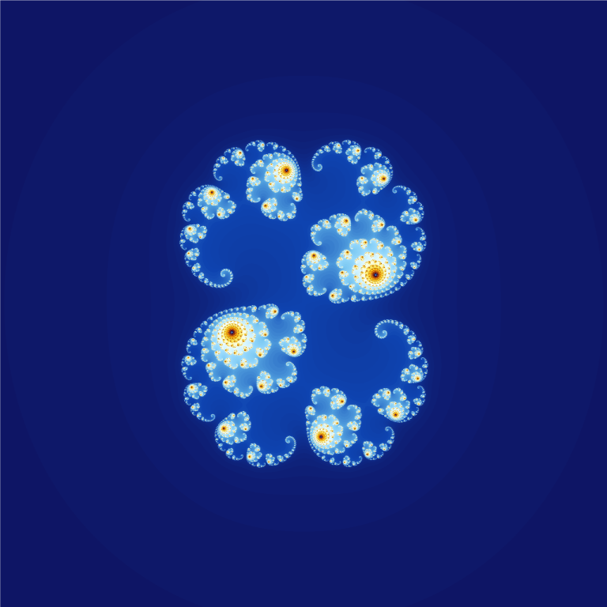

# Fract-ol

**Fract-ol** is a graphical application developed in C that visualizes complex fractals such as the Mandelbrot and Julia sets. This project is part of the **42 curriculum**, designed to strengthen your skills in graphics rendering, mathematical algorithms, and low-level programming using the MiniLibX library.

## Fractal Visualizations
Here are some of the fractal visualizations included in the project:

### Mandelbrot Set

This image of the Mandelbrot set shows detailed patterns at 300 DPI.

### Julia Set

This PNG image shows a detailed view of the Julia set fractal with parameters 0.285 and 0.01.

### Tricorn

This image represents the Tricorn fractal, a variation of the Mandelbrot set with a unique transformation.

### Dancing Julia (Julia Set)

This is a GIF animation of the Julia set fractal, showcasing its dancing behavior.

## Usage

### Requirements

 - GNU/Linux
 - `gcc` (or another C compiler)
 - `make`
 - X11 libraries: `libX11`, `libXext` and optionally `libbsd`
 - [MinilibX](https://github.com/42paris/minilibx-linux) (included as submodule)

> Make sure required libraries are installed:

```bash
sudo apt install libx11-dev libxext-dev libbsd-dev
```

### Cloning the Repository

To get started with the project, clone the repository to your local machine:

```bash
git clone --recurse-submodules https://github.com/droubarka/fract-ol.git
```

### Running the Program

```bash
cd fract-ol
make mlx all
./fractol --help
```
